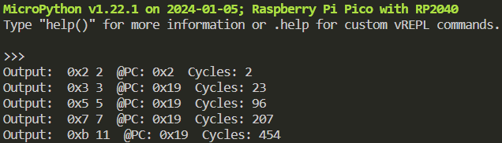
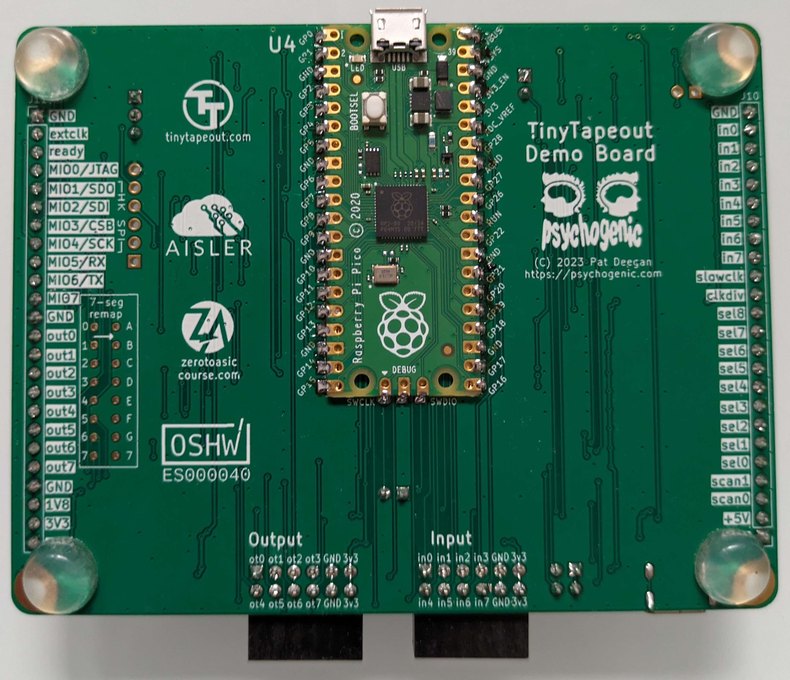
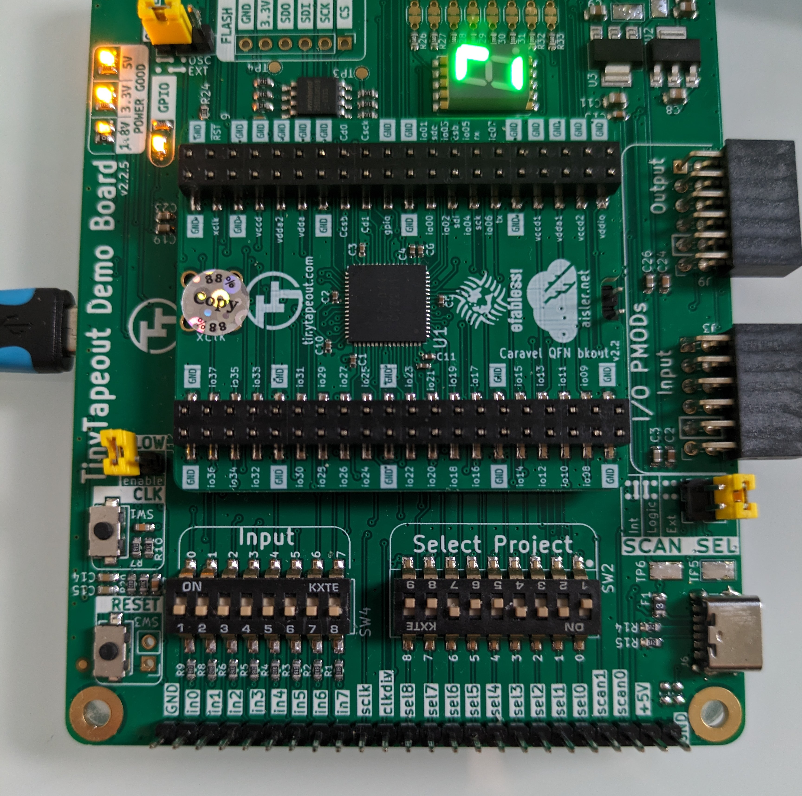

# Raspberry Pico based test setup for Zinnia+

This folder contains micropython programs that can be used in combination with a Raspberry Pico (or similar RP2040 board) to test the Zinnia CPU.

These examples use asynchronous clocking via in[0] and are therefore limited to a rather low clock rate of <=1kHz with the tt02 scanchain setup. Faster clocking would be possible by referencing to the "slow_clk". This would require soldering an additional wire to connect this output to the raspberry pi pico. This has not been tested yet by me.

## 📂 Description of files

- `readinputs_tt02.py`: Test to read in[7:0] and out[7:0] from the board.
- `Zinnia_tt02_Instructiontest.py`: This test various instructions on the CPU
- `Zinnia_tt02_execute.py`: Execute a program on the CPU. The output will be shown in the python REPL. The program object file (.o) needs to be uploaded to the RP2040 file system first. See [../src/assembler](../src/assembler)
- `fibonacci.o`: Program calculates the fibonacci sequence and prints the result to the console.
-  `primes.o`: This program calculates prime numbers.
  
## 📦 Prerequisites

- A Raspberry Pi Pico has to be soldered to the rear side of the TinyTapeout Demo Board (see picture below).
- The micropython up2 images has to be installed on the Pico. [Latest image](https://micropython.org/download/RPI_PICO/). I am using the 'micropico' plugin for VSCODE as a development environment, but others may work as well.
- The board should be powered only by the USB port on the Pico.
- The *SLOW_CLK* jumper needs to be pulled. 
- All *Input* switches need to be in the "off" position.
- The *Select project* switches need to be configured to select the Zinnia design. (see picture below)

## Example output

## Mounted Raspberry Pico on TinyTapeout Demo Board

  

## Switch configuration

  

